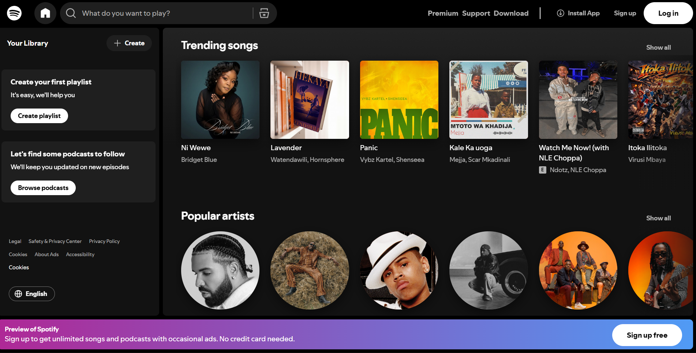

# 🎧 Spotify UI Clone | Music Streaming Interface

A modern **Spotify-inspired music streaming interface** built using **HTML5, CSS3, Bootstrap 5, Bootstrap Icons, and JavaScript**.

This project recreates the **clean layout and interactive experience of Spotify**, featuring sections like **popular artists, trending songs, playlists, and a music player interface**.

It is designed as a **frontend UI clone** for learning and practicing modern web design techniques.



---

# ✨ Features

- 🎵 **Spotify-inspired UI Design**
- 📱 **Fully Responsive Layout**
- 🎤 **Popular Artists Section**
- 🔥 **Trending / Popular Songs**
- 🎶 **Music Player Interface**
- 🎧 **Playlist Style Layout**
- 🎨 **Modern Icons using Bootstrap Icons**
- ⚡ **Fast and lightweight interface**

---

# 🧰 Tech Stack

| Technology | Purpose |
|-----------|--------|
| **HTML5** | Structure and layout |
| **CSS3** | Custom styling |
| **Bootstrap 5 (v5.3.2)** | Responsive grid and components |
| **Bootstrap Icons (v1.11.1)** | Icons used across the interface |
| **JavaScript** | Interactive UI elements |

---

# 📁 Project Structure

```bash
Spotify-clone/
├── assets/
│   ├── css/           # Stylesheets for layout and design
│   ├── images/        # Images (artists, songs, README preview)
│   └── js/            # JavaScript files for UI interaction
│
├── index.html         # Main interface page
└── README.md          # Project documentation